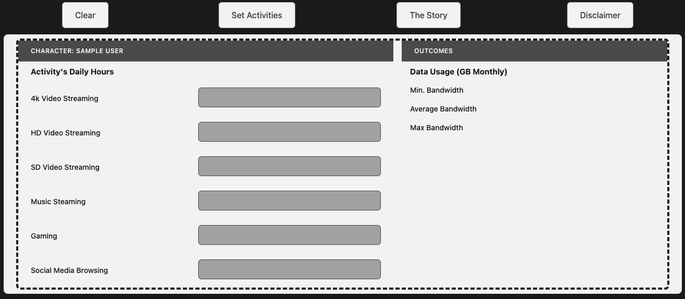

## About ELTsim
A test run & use case of [EvoELT](https://github.com/KenennaOkeke/EvoELT).

### Overview
An interface that sets activities for a Sims character and returns estimated metrics.

### Frontend

### How to run
1. Dockerize EvoELT
2. READMEs in each folder
3. Load the UI and set character's activities
4. Check character's metrics
