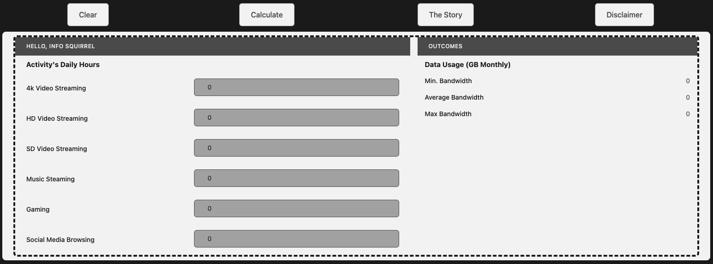
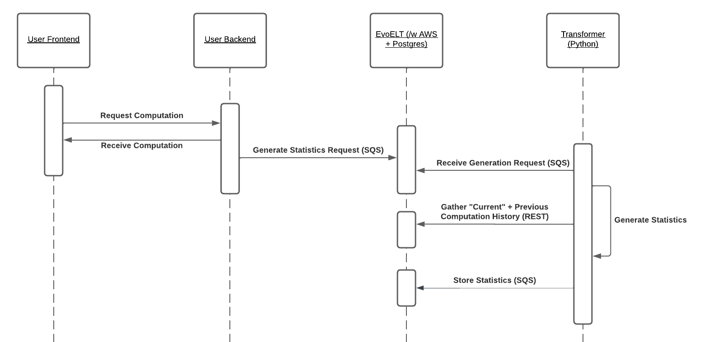
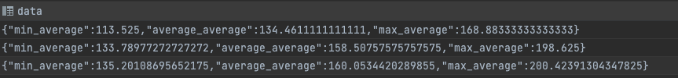

## About ELTsim
A test run & use case of [EvoELT](https://github.com/KenennaOkeke/EvoELT) using a Vue.js frontend, Express.js backend, and some python for backend processing. EvoELT is written in Kotlin, akin to Java.

### Overview
A calculator that estimates data usage. Statistics are processed for each user: minimum, average (mean), and maximum both for each calculation and all calculations (average of averages).

### Frontend View

### Process

### End Product
Info from the previous plays is used to generate further statistics:

*a mean of means, mean of mins, and mean of maxes*

### Breakdown
1. The frontend asks the backend for a calculation
2. The backend provides the calculation to the frontend, and sends the statistical request to EvoELT via Message Queuing Service (AWS SQS)
3. The transformation/processing application generates statistics based on previous calculations (tied to the user) and sends them back to EvoELT for storage

### How to run
1. Dockerize [EvoELT](https://github.com/KenennaOkeke/EvoELT).
2. Readmes:
   1. the `python_raw_to_processed` folder 
   2. the `javascript_express_user_backend` folder
   3. the `javascript_vue_user_frontend` folder
3. Load the UI and pick your user
4. Calculate your bandwidth and lo and behold the Postgres DB